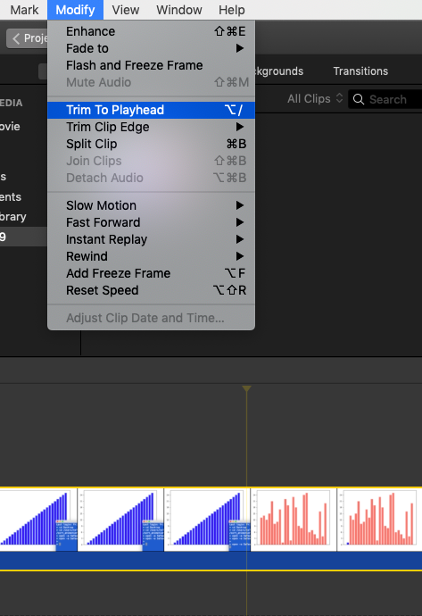

#### Editing video

QuickTime Player has a screen recording mode (under File > New Screen Recording).  The stop button will be up in the menu bar.

#### VLC

- Drag and drop a source movie file onto the VLC window.  
- Hit the spacebar to stop playback.
- Drag the little circle in the slot at the bottom to where you want to start recording.

- Select Playback > Record
- Play the video up until where you want to end it.  Hit the spacebar to stop.
- Click on Record again to **de-select** it.

The new recording will be in your default location.  

This can be changed under Preferences > Input / Codecs.

There is an option under File > Advanced Open File to open a file with the start and stop times specified.  But the record method doesn't work if I do that. 

Also, note that the quality of the output is less (and file size smaller) from VLC compared to iMovie.  I'm not clear on how to set that, either.

[movie](cfigs/vlc.mp4)

#### iMovie

In iMovie, import the movie file.  

After import, at the top left, click on the icon for the clip, it should acquire a yellow outline with "handles".  

Drag the handles to select where to trim the clip.  I remove a bunch of extra material (where I fumbled about trying to figure how to terminate the screen capture).  This is shown on the left in the image below

Next, create a new movie by clicking on "My Movie".  The file dialog is shown on the right in the image below.

When you have created a movie, you should see an area at the bottom of the screen

where you are supposed to drag clips.  Here we are after the drag.

![]cfigs/pic5.png)

It looks funny because the default resolution is low.  Adjust the slider at the upper right of this (bottom) panel.

I removed three frames from the beginning by clicking at the cut point (setting the "playhead"), and then choosing

- Modify > Trim To Playhead

Make sure the crop style is "Fit".

Export the modified clip by using 

- File > Share > File

[movie](cfigs/out.mp4)