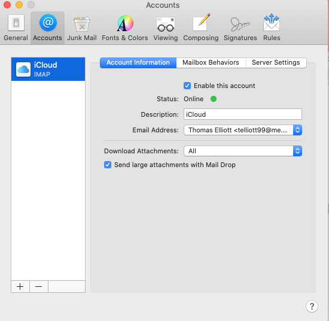
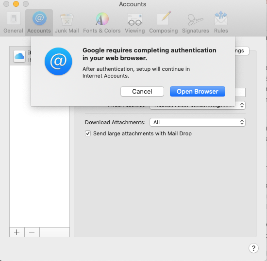
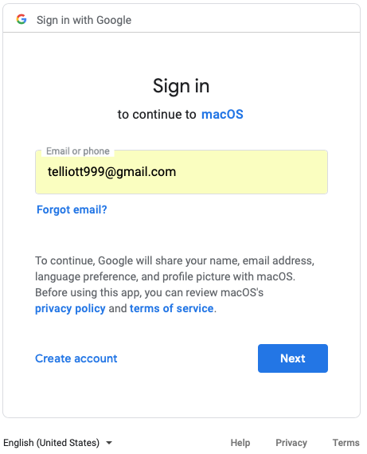
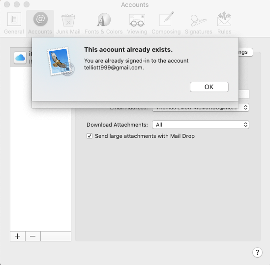
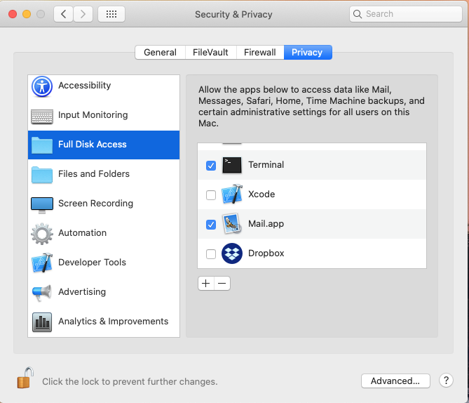
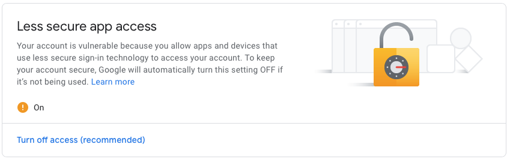

#### TL;DR

On the new Mac mini (purchased 12-2019), I'm trying to get gmail working through Apple's Mail, and it didn't happen.

When I try to add Google as an Account in ``Mail > Preferences``, Google requires authentication via the browser, and then nothing happens.  The account is not added to the list.

 

#### Solved!

Delete the Google account from Internet Accounts.  Add it back and select the checkbox to allow Mail.app to use it.  It works.

#### More

I was able to add Google as an "Internet Account".

 

This is a System Prefs thing, also available from ``Mail > Accounts...``.

when I go to ``Mail > Preferences...`` like usual, select the Accounts tab and then + to add an account.  ``Choose a Mail account provider...`` and select Google.  I get:

So I open the browswer and authenticate

and then it goes back to the Accounts tab which says:

Click OK and then I still have only the iCloud acccount.

#### Ideas

Catalina is more strict about privacy.  I added Mail.app to have Full Disk Access

I went to Google in Safari and set it to allow less secure app access.

>    A less secure app (LSA) is an app that connects to Google accounts using only username and password verification for access and not OAuth. Generally, you should only allow your users to use external apps that connect to Google accounts via OAuth, as LSAs make user accounts more vulnerable to hijacking. 

According to the web, Apple Mail "handles OAuth2 just fine."

According to Google, it has access to macOS.  Does that mean it's connected to Mail?

I rebooted the mini.  None of this has helped so far.  I went ahead and turned off the LSA access in Google.

