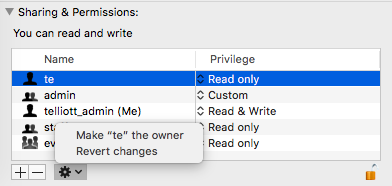
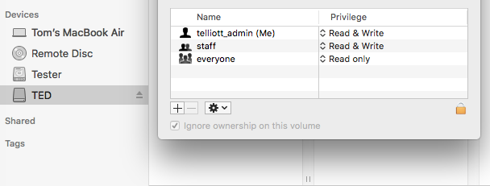

#### Basic Unix permissions 

Unix permissions divide the world into three parts:  user, group and other (sometimes called world).

For each of these, there is a separate permission for reading, writing, or executing a file.

A file's permissions can be displayed with ``ls -l``.  The ``-l`` flag is for long, or verbose, output:

```
> echo "hello, file world" > x.txt
> cat x.txt
hello, file world
> ls -l x.txt
-rw-r--r--  1 telliott_admin  staff  18 Feb 27 07:17 x.txt
>
```

The first ten characters printed

```
-rw-r--r--
```

are the **file mode** followed by the permissions for users-group-other.  This file's file mode is ``-``, which means it is just a regular file.

The default permissions are read and write for the user, me, read for my group (staff), and read for everyone else.

The commands  ``chown``, ``chgrp``, ``chmod`` are used to change the owner, group and permissions.

Suppose I try to execute the file ``x.txt``:

```
> ./x.txt
-bash: ./x.txt: Permission denied
>
```

To change the file permission to allow execution:

```
> chmod 744 x.txt
> ls -al x.txt
-rwxr--r--  1 telliott_admin  staff  18 Feb 27 07:17 x.txt
>
```

By specifying ``7``, I've given myself the ability to execute this file.  However, it is not a real executable so not much happens if I try to do that:

```
> ./x.txt
./x.txt: line 1: hello,: command not found
>
```

(Unix requires a leading ``./`` to execute from the current directory).

If I change the contents of the file to be:

```
#! /usr/bin/python
print "hello, file world"
```

then

```
> ./x.txt
hello, file world
>
```

The leading ``7`` in ``744`` is really binary ``111`` (4 + 2 + 1), where each bit in order is for read-write-execute.  Thus, 6 is read and write, and 7 is all three.

``chmod`` also has a second mode of invocation called symbolic.  

The "grammar" for symbolic mode includes ``u``, ``g`` and ``o`` (user-group-other) and ``r``, ``w``, ``x``, as well as ``+`` and ``-``.

For example, starting with ``rw-r--r--``, these two commandså give equivalent results:

- ``chmod 744 x.txt``
- ``chmod u+x x.txt``

There is much more.  See the man pages.

Notice the examples here do not require ``sudo``.

#### /usr/local

Here is a simple demo of the enforcement of the permissions for read.  The directory ``/usr/local`` has changed in High Sierra.  It used to be owned by me.  And you can no longer do ``chown`` on it.  However, you can do anything to items that are inside it.

So if I do the following as user1 (from my Desktop):

```
> sudo cp x600.txt /usr/local
> ls -ael /usr/local/x600.txt
-rw-------  1 root  wheel  18 Feb 27 10:52 /usr/local/x600.txt
> sudo cp x644.txt /usr/local
> ls -ael /usr/local/x644.txt
-rw-r--r--  1 root  wheel  18 Feb 27 10:54 /usr/local/x644.txt
>
```

And then login with Terminal as user2 and do:

```
$ cat /usr/local/x644.txt
hello, file world
$ cat /usr/local/x600.txt
cat: /usr/local/x600.txt: Permission denied
$ 
```

#### User1 and User2

Naively, you might think that any other user could then read the file ``x.txt`` on my Desktop. 

Login as another user (user2) whose prompt is ``$``:

```
$ cat /Users/telliott_admin/Desktop/x.txt
cat: /Users/telliott_admin/Desktop/x.txt: Permission denied
$ open -a TextEdit /Users/telliott_admin/Desktop/x.txt
The file /Users/telliott_admin/Desktop/x.txt does not exist.
$ ls -l /Users/telliott_admin/Desktop/x.txt
ls: /Users/telliott_admin/Desktop/x.txt: Permission denied
$
```

This is not due to access control lists (see below), because this file doesn't have one.  It is enforced at a higher level of the file system.

Going to System Preferences > Sharing and clicking on the checkbox for File Sharing (followed by restart) does not change this behavior.

Do this:

```
> echo "hello, file world" > x.txt
> cp x.txt x600.txt
> chmod 600 x600.txt
> ls -al x600.txt
-rw-------  1 telliott_admin  staff  18 Feb 27 10:03 x600.txt
>
```

Use the Finder to drag the file ``x600.txt`` into the user2's Drop Box.  The path to this directory from his home directory is ``Public/Drop\ Box/x.txt``.

```
$ cat x600.txt
hello, file world
$
```

Hmmm... we expected to be denied.  One possible reason would have been that user1 and user2 have the same group (``staff``), but we explicitly denied group read permission with the first ``0`` in ``600``.

This attribute didn't change during the copy:

```
$ ls -al x600.txt
-rw-------+ 1 telliott_admin  staff  18 Feb 27 10:03 x600.txt
$
```

However, notice the little ``+`` on the end of the permissions.  This indicates that an access control list has been added.  We can look at it by providing the ``-e`` flag to ``ls``:

```
$ ls -ael x600.txt
-rw-------+ 1 telliott_admin  staff  18 Feb 27 10:03 x600.txt
 0: user:te inherited allow read,write,execute,delete,append,readattr,writeattr,readextattr,writeextattr,readsecurity,writesecurity,chown
$
```

We have a bunch of stuff that has been stuck on there during the copy.  This explains why the read succeeded.  The owner and group did not change during the copy.

To clear the access control list supply the ``a`` flag to ``chmod``.  ``#`` allows us to change individual entries, of which there is only one, numbered ``0``.  Unlike the usual case, here the leading ``-`` doesn't mean this is a flag, it alters the mode ``a`` to delete the ACL item specified next.

```
$ chmod -a# 0 x600.txt
$ ls -ael x600.txt
-rw-------  1 telliott_admin  staff  18 Feb 27 10:03 x600.txt
$ cat x600.txt 
cat: x600.txt: Permission denied
$
```

#### Access control lists

ACL entries provide more fine-grained access control.  If present, these are displayed with the ``e`` flag to ``ls``, and manipulated using ``chmod``.  For example:

```
> chmod +a "admin allow write" y.txt
> ls -le y.txt
-rwxr--r--+ 1 telliott_admin  staff  18 Feb 27 07:17 y.txt
 0: group:admin allow write
>
```

These can be quite complicated, see the man pages for ``chmod``.

Let's look at the defaults for my Desktop.  The ``a`` flag says to include invisible files like the ``.`` or current directory.

```
> ls -ale .
total 146696
drwxr-x---@ 18 telliott_admin  staff       576 Feb 27 08:23 .
 0: group:everyone deny delete
drwxr-x---+ 61 telliott_admin  staff      1952 Feb 26 14:20 ..
 0: group:everyone deny delete
```

ACLs can also be manipulated (in a somewhat limited way) in the Finder.



#### External drive

We can also try to transfer the file by using an external drive, such as a USB stick, formatted as Mac OS Extended (Journaled), aka HFS+.

If I select the volume and do Get Info, by default it looks like this:



There is a checkbox at the very bottom of the window labeled **Ignore permissions on this drive**.  Transferring files we would normally not want to keep restricted permissions, unless we were (say) backing up a file system.  Then we would want this.

So authenticate and uncheck the box.  Remove and reinsert the drive and the new setting is preserved.  Drag ``x600.txt`` to the drive.  Unexpectedly, this requires an Admin password.

In user2's Terminal, navigate to ``/Volumes/TED``.

```
$ ls -ael x600.txt
-rw-------  1 telliott_admin  wheel  18 Feb 27 10:03 x600.txt
$
```

No apparent ACL.  Notice that the owner's group has changed to ``wheel``.  Now try to copy the file the user2's Desktop:

```
$ cp /Volumes/TED/x.txt .
cp: /Volumes/TED/x.txt: No such file or directory
$
```

There's your restrictions.  Copy requires read access and it ain't happening.  ``cat`` doesn't work either.  Logout and then login as user2 and drag the file to the Desktop.  Finder requires and Admin name and password.  Logout and login as user1.  In Terminal, login as user2 and ``cd`` to the Desktop.  ``x600.txt`` is there.  Now

```
$ ls -ael x600.txt
-rw-------  1 te  staff  18 Feb 27 10:03 x600.txt
=$ cat x600.txt
hello, file world
$ 
```

Now what happened?  Well, the fact that the ``ls`` worked should have been a clue.  The Finder changed the owner to user2 during the copy.

As user1 in Terminal go the user2's Desktop:

```
> sudo cd /Users/te/Desktop
Password:
> sudo chown telliott_admin x600.txt
> ls -ael x600.txt
-rw-------  1 telliott_admin  staff  18 Feb 27 10:03 x600.txt
>
```

Relaunch Terminal.  Login as user2.  Now look at the file:

```
$ ls -ael x600.txt
-rw-------  1 te  staff  18 Feb 27 10:03 x600.txt
$ cat x600.txt
hello, file world
$
```

The same file shows up with different owners depending on how we're logged in!!
