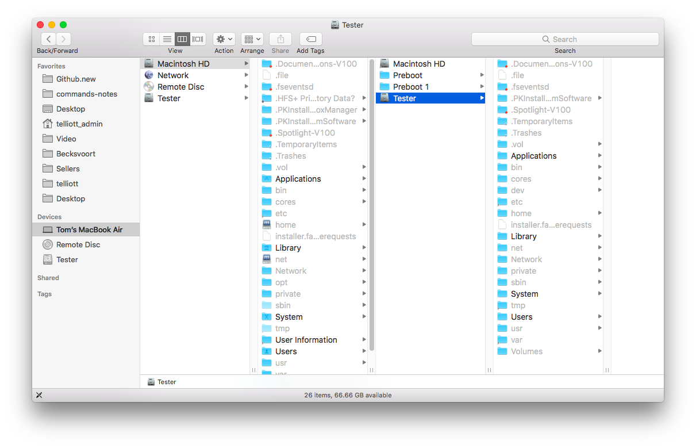

#### Finder

Toggle hidden files in Finder with ``Cmd+Shift+.``  That's command-shift-dot.

This is persistent.

I go to Macintosh HD and then I can see the hidden directory ``Volumes``, ``Tester`` and see the files of its ``Users``.

Most of user ``te2`` files are not available, but ``te1`` are, including ``.bash_history``, for example.
