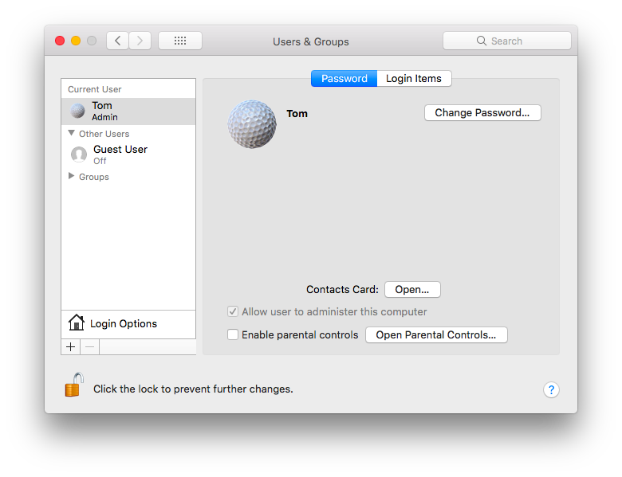

I ran into a question about how to un-bork macOS, and to test this I decided to install 10.13.3 High Sierra on a separate partition.

That is in a separate write-up.

If there is just one user on a Mac, s/he should be Admin, since this is the type of account created during system installation.

Supposedly, if the user unchecks the box for ``allow user to administer this computer`` in 

System Preferences > Users & Groups

Then there would be no Admin account and no way to fix things.

#### Problem

The problem we're trying to solve is caused by a single Admin user changing his/her account to Standard.  If successful, this would leave the computer without an Admin account.  Catch 22.

However, in my newly setup Volume, if you go to System Preferences > Users & Groups, choose the new user account and authenticate, we get:



The checkbox for 

```Allow user to administer this computer```

is selected, but grayed out.  It isn't possible, at least currently, to bork the system in  this way.

I did see some reports that this "happened on its own" during an OS upgrade.


#### Single User Mode

The recommended recovery method, if you were to be borked, is to boot into single user mode 

(restart and hold down Cmd+S)

The screen should say:

```
Root device is mounted read only

If you want to make modifications to files:
        /sbin/fsck -fy
        /sbin/mount -uw /
```

The first command is "file system consistency check".

The second command mounts the disk / (that's what we want), as writeable.  So do that.  

(Note that the leading ``/sbin/`` is unnecessary, since ``which mount`` gives ``/sbin/mount``).

Now do:

```
rm /var/db/.AppleSetupDone
```

This is an empty file which serves as a flag during startup.

If it's not present then the Mac will finish the Setup process that normally happens during install, and that includes setting the new account's group to Admin.

And then:

```
reboot
```

Note:  this method resets System Prefs including the dock and mouse, etc., so it's better to just make a new Admin account rather than to work on the existing one that got messed up.  That old account will still be there when you're done, and can be upgraded to Admin using the new account.

#### root

If you had root enabled, you could also login as root, and then do (very simply)

```
dscl . -append /Groups/admin GroupMembership username
```

``dscl`` is the Directory Services Command Line Utility.

Of course, in our scenario, root has not been enabled, and their is no Admin user to do that.  

I was excited when trying out single user mode because I noticed that the prompt is

```
localhost:/ root #
```

``whoami`` returns ``root``.

You are indeed root.

#### Upgrading what's possible 

But your powers are quite diminished in single user mode, because nearly all daemons are not loaded (and cannot be loaded, as of High Sierra). 

Stuff that worked in the old days like

```
launchctl load /System/Library/LaunchDaemons/com.apple.DirectoryServices.plist
```

don't work.  I couldn't even figure out how to scroll the screen back to read the ouput that is shown during startup.

I did figure out that you can do

```
launchctl load /System/Library/LaunchDaemons/com.apple.opendirectoryd.plist
passwd root
```

you will be prompted to enter a password twice.

If you were root in the normal way, you could do the last of these commands (which together set up a new user):

```
dscl . -create /Users/username
dscl . -create /Users/username UserShell /bin/bash
dscl . -create /Users/username RealName "John Smith"
dscl . -create /Users/username UniqueID 1001"
dscl . -create /Users/username PrimaryGroupID 1000"
dscl . -create /Users/username NFSHomeDirectory /Local/Users/username
dscl . -passwd /Users/username password
dscl . -append /Groups/admin GroupMembership username
```

What is needed for ``dscl`` (directory services command line utility)?

The ``opendirectoryd`` is not enough.


Get out with 

```
reboot
```

