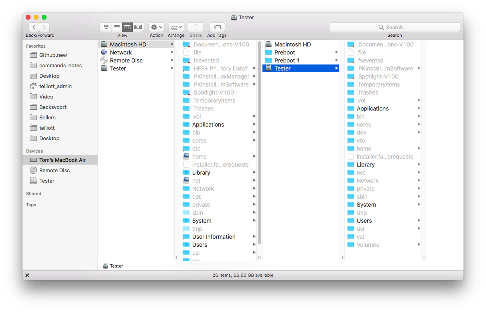

### Shortcuts or key combinations

#### Finder

Toggle hidden files in Finder with ``Cmd+Shift+.``

This is persistent.

I go to Macintosh HD and then I can see the hidden directory ``Volumes``, ``Tester`` and see the files of its ``Users``.

Most of user ``te2`` files are not available, but ``te1`` are, including ``.bash_history``, for example.

#### Reboot

[docs](https://support.apple.com/en-us/HT201255)

- ``Shift`` safe mode
- ``D`` diagnostics mode
- ``T`` target disk mode
- ``Cmd+R`` recovery mode
- ``Cmd+S`` single user mode

and more.